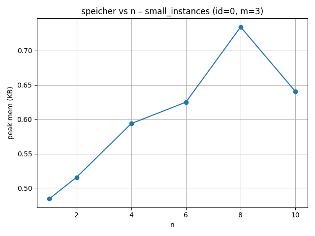
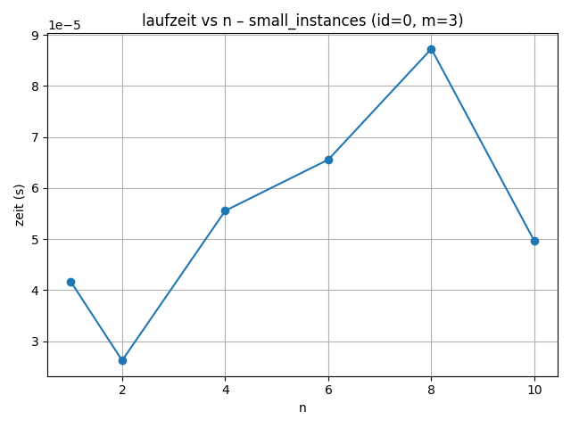
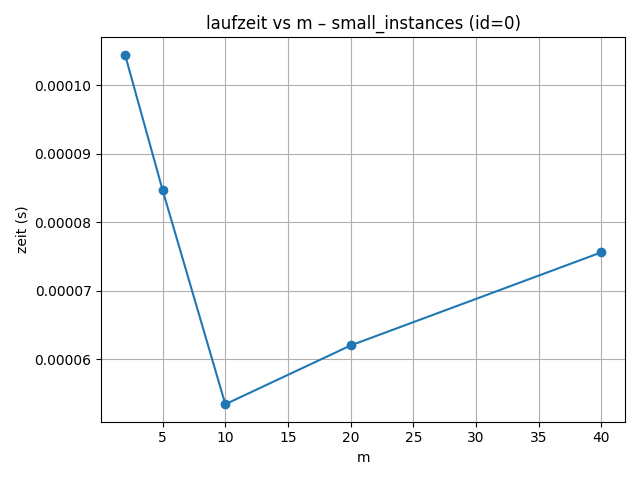
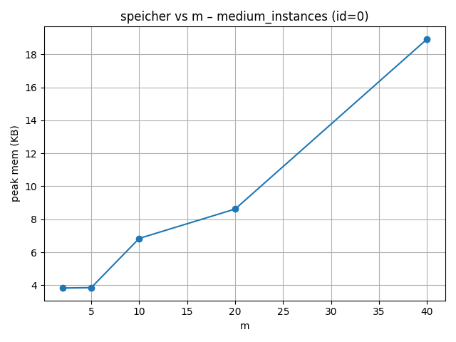
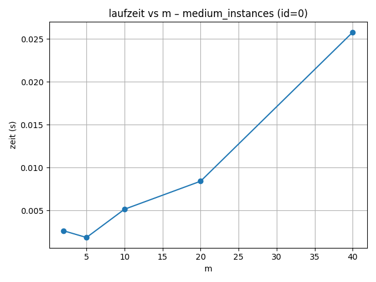
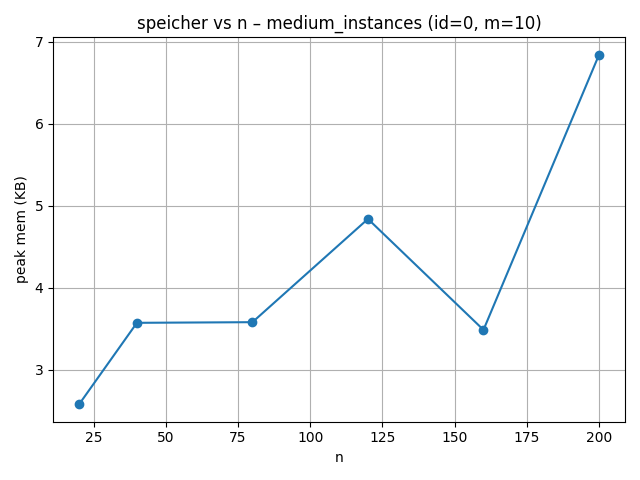
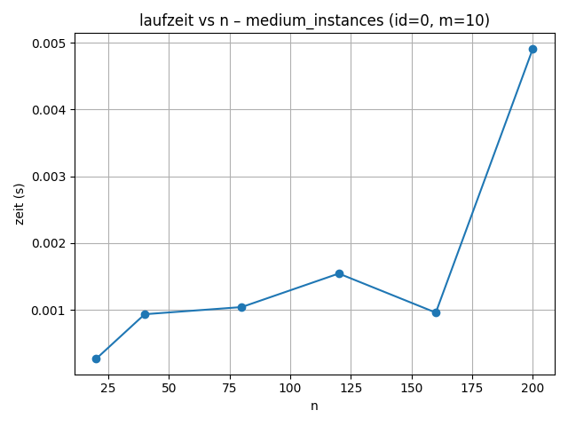
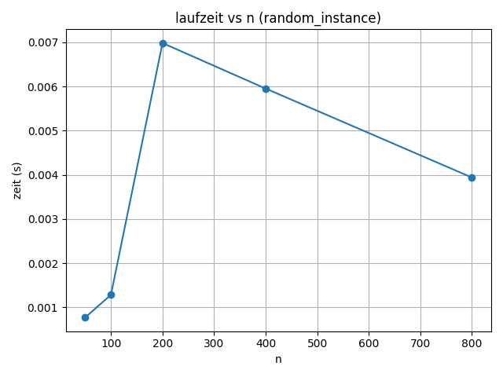
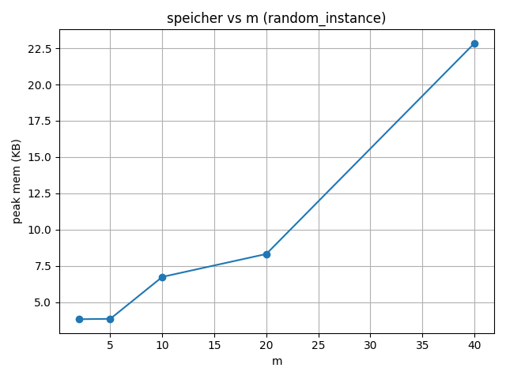
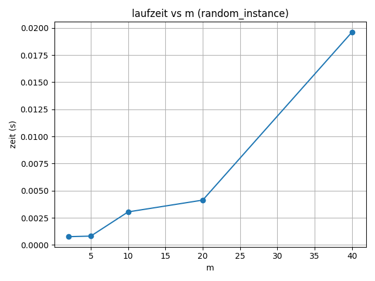

# Operations Research

## Aufgabe 2: MULTIFIT Algorithmus

### Autor: Cat Lam Tang (MatrikelNr: 1161546), Korab Selmonaj, Gülhan Metehan Turkan,Lara Schulz

Dieses Projekt enthält die Lösungen zu Aufgabe 2 des Moduls Operations Research und fokussiert den MULTIFIT-Algorithmus aus Kapitel 8.2 von Lenstra & Shmoys. Der Schwerpunkt liegt auf Bin-Packing mit **First-Fit Decreasing (FFD)** als Sub-Routine sowie der Analyse von Laufzeit- und Speicherverhalten für unterschiedliche Instanzgrößen.

---

## Aufgabenstellung (Aufgabe 2)

> Lest euch in „Elements of Scheduling“ von Lenstra und Shmoys den ersten Teil von Kapitel 8.2 durch.
>
> Implementiert den MULTIFIT Algorithmus. Nutzt dabei FFD Bin Packing als ausgelagerte Sub-Routine.
>
> Testet den MULTIFIT Algorithmus mit den Testinstanzen und erstellt Diagramme für die Laufzeiten und den Speicherplatz. Erstellt außerdem weitere Testinstanzen, bei denen ihr einen Parameter verändert (z. B. mehr Jobs oder mehr Maschinen) und die anderen Parameter unverändert lasst. Nehmt diese Daten in eure Diagramme mit auf und diskutiert sie kurz (Welcher Verlauf lässt sich beobachten? Passt das zu dem erwarteten Verlauf?). Ihr könnt dabei (müsst aber nicht) das Programm für die von uns zur Verfügung gestellten Testinstanzen nutzen und anpassen. (Das ist im Ordner Testinstanzen.)

---

## Umsetzung und Dateien

- `Aufgabe2.py` implementiert List Scheduling, LPT, die FFD-Bin-Packing-Routine sowie den MULTIFIT-Algorithmus und liefert einfache Benchmark-Hilfen.
- `instanceCreator.py` erzeugt zusätzliche Testinstanzen mit variierenden Parametern und ist das mitgelieferte Skript aus der Aufgabenstellung.
- `instances/` enthält die bereitgestellten YAML-Testinstanzen aus dem Aufgabenblatt.
- `out_multifit/` speichert die generierten Diagramme (Laufzeit und Speicher) für verschiedene Instanztypen.

---

# MULTIFIT Algorithmus – Projektübersicht

## Aufgabe

Basierend auf Kapitel 8.2 aus *Elements of Scheduling* von Lenstra & Shmoys wurde der **MULTIFIT-Algorithmus** implementiert, unterstützt durch **First-Fit Decreasing (FFD)** als Bin-Packing-Subroutine. Ziel war es, Testinstanzen mit variierenden Parametern (Anzahl Jobs n, Maschinen m) zu analysieren und das Verhalten hinsichtlich **Laufzeit** und **Speicherverbrauch** zu untersuchen.

## Vorgehen

- MULTIFIT verwendet Binärsuche zwischen unterer und oberer Schranke des Makespans.
- FFD prüft dabei, ob sich Jobs mit gegebenem Limit auf m Maschinen einpassen lassen.
- Getestet wurden drei Instanztypen: `small_instances`, `medium_instances`, `random_instances`.

---

## Diagrammanalyse

### Small Instances

- **Speicherverbrauch steigt leicht mit n**:

  

- **Laufzeit reagiert auf n und m nichtlinear**:

  

  

### Medium Instances

- **Stärkere Skalierung bei Speicher- und Laufzeit**:

  

  

- **n beeinflusst Speicher und Zeit sichtbar**:

  

  

### Random Instances

- **Speicher steigt stark mit n**:

  

- **Laufzeit unregelmäßig, evtl. durch Verteilung**:

  

- **m wirkt sich stärker auf Ressourcen aus**:

  

  

---

## Fazit

Die Ergebnisse zeigen erwartungskonformes Verhalten bei small/medium Instanzen. Bei zufälligen Instanzen sind Abweichungen möglich, z. B. durch günstige Packverteilungen. Die Diagramme veranschaulichen deutlich die Auswirkungen der Parameter n und m.
